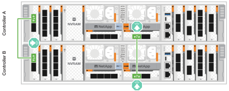
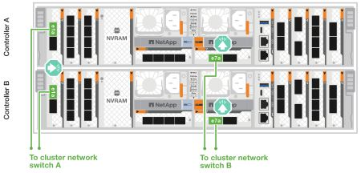
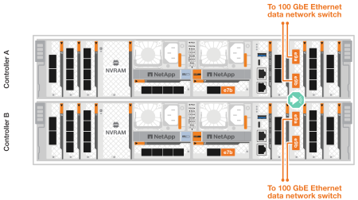
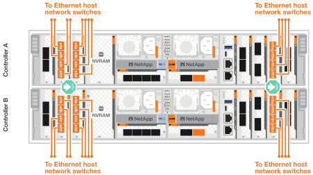
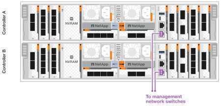
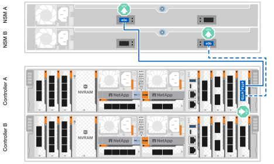
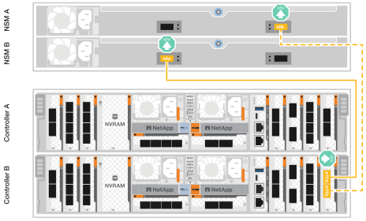
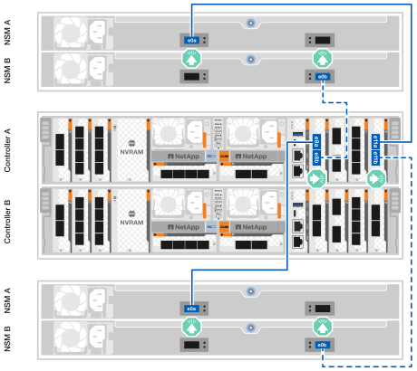
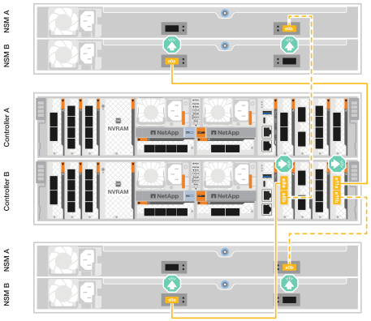

= ASA A70 및 ASA A90 스토리지 시스템의 하드웨어 케이블 연결
:allow-uri-read: 
:icons: font
:imagesdir: ../media/

[role="lead"]
ASA A70 또는 ASA A90 스토리지 시스템을 네트워크 및 스토리지 셸프에 연결하여 클러스터 통신, 관리 액세스 및 SAN 호스트 연결을 활성화하십시오. 이 절차에는 클러스터/HA 인터커넥트, 관리 네트워크, 호스트 네트워크 및 스토리지 셸프 연결을 위한 케이블링이 포함됩니다.

.시작하기 전에
스토리지 시스템을 네트워크 스위치에 연결하는 방법에 대한 자세한 내용은 네트워크 관리자에게 문의하십시오.

.이 작업에 대해
* 다음 절차는 일반적인 구성을 보여 줍니다. 특정 케이블 연결은 스토리지 시스템용으로 주문한 구성 요소에 따라 다릅니다. 포괄적인 구성 및 슬롯 우선 순위에 대한 자세한 내용은 을 link:https://hwu.netapp.com["NetApp Hardware Universe를 참조하십시오"^]참조하십시오.
* ASA A70 및 ASA A90의 I/O 슬롯은 1부터 11까지 번호가 매겨져 있습니다.
+
image::../media/drw_a1K_back_slots_labeled_ieops-2162.svg[ASA A70 및 ASA A90 컨트롤러의 슬롯 번호 매기기]

* 케이블 연결 그래픽에는 포트에 커넥터를 삽입할 때 케이블 커넥터 당김 탭의 올바른 방향(위 또는 아래)을 나타내는 화살표 아이콘이 있습니다.
+
커넥터를 삽입할 때 딸깍 소리가 들려야 합니다. 딸깍 소리가 안 되면 커넥터를 제거하고 뒤집은 다음 다시 시도하십시오.

+
image:../media/drw_cable_pull_tab_direction_ieops-1699.svg["케이블 당김 탭 방향"]

* 광 스위치에 케이블로 연결하는 경우 광 트랜시버를 컨트롤러 포트에 삽입한 후 스위치 포트에 연결합니다.

== 1단계: 클러스터/HA 연결 케이블 연결

컨트롤러를 케이블로 연결하여 ONTAP 클러스터 연결을 생성합니다. 스위치가 없는 클러스터의 경우 컨트롤러를 서로 연결합니다. 스위치 클러스터의 경우 컨트롤러를 클러스터 네트워크 스위치에 연결합니다.

NOTE: 클러스터 인터커넥트 트래픽과 HA 트래픽은 동일한 물리적 포트를 공유합니다.

[role="tabbed-block"]
====
.스위치가 없는 클러스터 케이블 연결
--
클러스터 네트워크 스위치를 사용하지 않고 두 컨트롤러를 직접 연결하는 경우 이 케이블링 옵션을 사용하십시오.

클러스터/HA 인터커넥트 케이블을 사용하여 포트 E1A에 E1A를 연결하고 포트 e7a에 e7a를 연결합니다.

.단계
. 컨트롤러 A의 포트 E1A를 컨트롤러 B의 포트 E1A에 연결합니다
. 컨트롤러 A의 포트 e7a를 컨트롤러 B의 포트 e7a에 연결합니다.
+
* 클러스터/HA 인터커넥트 케이블 *

+
image::../media/oie_cable_25Gb_Ethernet_SFP28_IEOPS-1069.svg[클러스터 HA 케이블]

+

--
.스위치 클러스터 케이블링
--
컨트롤러를 서로 직접 연결하는 대신 클러스터 네트워크 스위치에 연결할 때 이 케이블링 옵션을 사용하십시오.

100GbE 케이블을 사용하여 포트 e1a와 e7a를 클러스터 네트워크 스위치에 연결하십시오.

NOTE: 스위치드 클러스터 구성은 ONTAP 9.16.1 이상에서 지원됩니다.

.단계
. 컨트롤러 A의 포트 E1A와 컨트롤러 B의 포트 E1A를 클러스터 네트워크 스위치 A에 연결합니다
. 컨트롤러 A의 포트 e7a와 컨트롤러 B의 포트 e7a를 클러스터 네트워크 스위치 B에 연결합니다
+
* 100 GbE 케이블 *

+
image::../media/oie_cable100_gbe_qsfp28.png[100 GbE 케이블]

+

--
====

== 2단계: 호스트 네트워크 연결 케이블 연결

이더넷 모듈 포트를 호스트 네트워크에 연결합니다.

다음은 일반적인 호스트 네트워크 케이블 연결 예시입니다. 특정 시스템 구성은 link:https://hwu.netapp.com["NetApp Hardware Universe를 참조하십시오"^]을 참조하십시오.

[role="tabbed-block"]
====
.100GbE 호스트 네트워크
--
포트 e9a 및 e9b를 100GbE 이더넷 데이터 네트워크 스위치에 연결합니다.

NOTE: 클러스터 및 HA 트래픽에 대한 최대 시스템 성능을 위해서는 호스트 네트워크 연결에 포트 e1b 및 e7b를 사용하지 마십시오. 성능을 극대화하려면 별도의 호스트 카드를 사용하십시오.

.단계
. 컨트롤러 A 포트 e9a 및 컨트롤러 B 포트 e9a를 이더넷 데이터 네트워크 스위치에 연결합니다.
. 컨트롤러 A 포트 e9b와 컨트롤러 B 포트 e9b를 이더넷 데이터 네트워크 스위치에 연결합니다.
+
* 100 GbE 케이블 *

+

+

--
.10/25 GbE 호스트 네트워크
--
각 컨트롤러의 10/25 GbE I/O 모듈 포트를 호스트 네트워크 스위치에 연결하십시오.

*10/25 GbE 케이블*

--
====

== 3단계: 관리 네트워크 연결 케이블 연결

컨트롤러를 관리 네트워크에 연결합니다.

1000BASE-T RJ-45 케이블을 사용하여 각 컨트롤러의 관리(렌치) 포트를 관리 네트워크 스위치에 연결합니다.

.단계
. 컨트롤러 A의 관리(렌치) 포트를 관리 네트워크 스위치에 연결합니다.
. 컨트롤러 B의 관리(렌치) 포트를 관리 네트워크 스위치에 연결합니다.
+
* 1000BASE-T RJ-45 케이블 *

+
image::../media/oie_cable_rj45.svg[RJ-45 케이블]

+

IMPORTANT: 아직 전원 코드를 연결하지 마십시오.

== 4단계: 선반 연결 케이블 연결

ASA A70 및 ASA A90 스토리지 시스템은 NSM100 또는 NSM100B 모듈을 사용하는 NS224 쉘프를 지원합니다. 모듈 간의 주요 차이점은 다음과 같습니다.

* NSM100 선반 모듈은 내장 포트 e0a 및 e0b를 사용합니다.
* NSM100B 쉘프 모듈은 슬롯 1의 포트 e1a와 e1b를 사용합니다.

다음 케이블 연결 예에서는 셸프 모듈 포트를 참조할 때 NS224 셸프의 NSM100 모듈을 보여줍니다.

스토리지 시스템에서 지원되는 최대 쉘프 수와 광 및 스위치 연결과 같은 모든 케이블 옵션은 을 참조하십시오.link:https://hwu.netapp.com["NetApp Hardware Universe를 참조하십시오"^]

[role="tabbed-block"]
====
.NS224 스토리지 쉘프 1개
--
NS224 쉘프가 하나만 있는 경우 이 케이블 연결 옵션을 사용하십시오.

각 컨트롤러를 NS224 쉘프의 NSM 모듈에 연결합니다. 그래픽은 각 컨트롤러의 케이블 연결을 보여줍니다. 컨트롤러 A 케이블은 파란색으로 표시되고 컨트롤러 B 케이블은 노란색으로 표시됩니다.

* 100 GbE QSFP28 구리 케이블 *

image::../media/oie_cable100_gbe_qsfp28.svg[100 GbE QSFP28 구리 케이블]

.단계
. 컨트롤러 A 포트 e11a를 NSM A 포트 e0a에 연결합니다.
. 컨트롤러 A 포트 e11b를 NSM B 포트 e0b에 연결합니다.
+

. 컨트롤러 B 포트 e11a를 NSM B 포트 e0a에 연결합니다.
. 컨트롤러 B 포트 e11b를 NSM A 포트 e0b에 연결합니다.
+

--
.NS224 스토리지 쉘프 2개
--
NS224 쉘프가 두 개 있는 경우 이 케이블 연결 옵션을 사용하십시오.

각 컨트롤러를 두 NS224 쉘프의 NSM 모듈에 연결합니다. 그래픽은 각 컨트롤러의 케이블 연결을 보여줍니다. 컨트롤러 A 케이블은 파란색으로 표시되고 컨트롤러 B 케이블은 노란색으로 표시됩니다.

* 100 GbE QSFP28 구리 케이블 *

image::../media/oie_cable100_gbe_qsfp28.svg[100 GbE QSFP28 구리 케이블]

.단계
. 컨트롤러 A에서 다음 포트를 연결합니다.
+
.. 포트 e11a를 쉘프 1 NSM A 포트 e0a에 연결합니다.
.. 포트 e11b를 쉘프 2 NSM B 포트 e0b에 연결합니다.
.. 포트 e8a를 shelf 2 NSM A 포트 e0a에 연결하십시오.
.. 포트 e8b를 shelf 1 NSM B 포트 e0b에 연결하십시오.
+

. 컨트롤러 B에서 다음 포트를 연결합니다.
+
.. 포트 e11a를 쉘프 1 NSM B 포트 e0a에 연결합니다.
.. 포트 e11b를 쉘프 2 NSM A 포트 e0b에 연결합니다.
.. 포트 e8a를 shelf 2 NSM B 포트 e0a에 연결하십시오.
.. 포트 e8b를 shelf 1 NSM A 포트 e0b에 연결하십시오.
+

--
====
.다음 단계
스토리지 컨트롤러를 네트워크에 연결한 다음, 컨트롤러를 스토리지 쉘프에 연결한 후에link:power-on-hardware.html["ASA R2 스토리지 시스템의 전원을 켭니다"]
