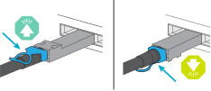

= ASA C30 스토리지 시스템의 하드웨어 케이블 연결
:allow-uri-read: 
:icons: font
:imagesdir: ../media/

[role="lead"]
ASA C30 스토리지 시스템을 네트워크 및 스토리지 셸프에 연결하여 클러스터 통신, 관리 액세스 및 SAN 호스트 연결을 활성화하십시오. 이 절차에는 클러스터/HA 인터커넥트, 관리 네트워크, 호스트 네트워크 및 스토리지 셸프 연결을 위한 케이블링이 포함됩니다.

.시작하기 전에
스토리지 시스템을 네트워크 스위치에 연결하는 방법에 대한 자세한 내용은 네트워크 관리자에게 문의하십시오.

.이 작업에 대해
* 다음 절차는 일반적인 구성을 보여 줍니다. 특정 케이블 연결은 스토리지 시스템용으로 주문한 구성 요소에 따라 다릅니다. 포괄적인 구성 및 슬롯 우선 순위에 대한 자세한 내용은 을 link:https://hwu.netapp.com["NetApp Hardware Universe를 참조하십시오"^]참조하십시오.
* 케이블 연결 그래픽에는 포트에 커넥터를 삽입할 때 케이블 커넥터 당김 탭의 올바른 방향(위 또는 아래)을 나타내는 화살표 아이콘이 있습니다.
+
커넥터를 삽입할 때 딸깍 소리가 들려야 합니다. 딸깍 소리가 안 되면 커넥터를 제거하고 뒤집은 다음 다시 시도하십시오.

+

* 광 스위치에 케이블로 연결하는 경우 광 트랜시버를 컨트롤러 포트에 삽입한 후 스위치 포트에 연결합니다.

== 1단계: 클러스터/HA 연결 케이블 연결

컨트롤러를 케이블로 연결하여 ONTAP 클러스터 연결을 생성합니다. 스위치가 없는 클러스터의 경우 컨트롤러를 서로 연결합니다. 스위치 클러스터의 경우 컨트롤러를 클러스터 네트워크 스위치에 연결합니다.

NOTE: 클러스터 인터커넥트 트래픽과 HA 트래픽은 동일한 물리적 포트를 공유합니다.

[role="tabbed-block"]
====
.스위치가 없는 클러스터 케이블 연결
--
클러스터 네트워크 스위치를 사용하지 않고 두 컨트롤러를 직접 연결하는 경우 이 케이블링 옵션을 사용하십시오.

.2개의 2포트 40/100 GbE I/O 모듈이 있는 ASA C30
슬롯 2와 4에 있는 I/O 모듈의 클러스터/HA 인터커넥트 포트를 케이블로 연결합니다.

NOTE: 클러스터 인터커넥트 트래픽과 HA 트래픽은 동일한 물리적 포트(슬롯 2와 4의 I/O 모듈)를 공유합니다. 포트는 40/100 GbE입니다.

.단계
. 컨트롤러 A 포트 e2a를 컨트롤러 B 포트 e2a에 연결합니다.
. 컨트롤러 A 포트 e4a를 컨트롤러 B 포트 e4a에 연결합니다.
+

NOTE: 입출력 모듈 포트 e2b 및 e4b는 사용되지 않으며 호스트 네트워크 연결에 사용할 수 있습니다.

+
* 100 GbE 클러스터/HA 인터커넥트 케이블 *

+
image::../media/oie_cable100_gbe_qsfp28.png[클러스터 HA 100GbE 케이블]

+
image::../media/drw_isi_a30-50_switchless_2p_100gbe_2card_cabling_ieops-2011.svg[100GbE I/O 모듈 2개를 사용하는 스위치가 없는 클러스터 케이블 연결 다이어그램]

.2포트 40/100 GbE 입출력 모듈 1개가 포함된 ASA C30
슬롯 4의 I/O 모듈에 있는 클러스터/HA 인터커넥트 포트를 케이블로 연결합니다.

NOTE: 클러스터 인터커넥트 트래픽과 HA 트래픽은 동일한 물리적 포트(슬롯 4의 I/O 모듈)를 공유합니다. 포트는 40/100 GbE입니다.

.단계
. 컨트롤러 A 포트 e4a를 컨트롤러 B 포트 e4a에 연결합니다.
. 컨트롤러 A 포트 e4b를 컨트롤러 B 포트 e4b에 연결합니다.
+
* 100 GbE 클러스터/HA 인터커넥트 케이블 *

+
image::../media/oie_cable100_gbe_qsfp28.png[클러스터 HA 100GbE 케이블]

+
image::../media/drw_isi_a30-50_switchless_2p_100gbe_1card_cabling_ieops-1925.svg[100GbE I/O 모듈 하나를 사용한 스위치가 없는 클러스터 케이블링 다이어그램]

--
.스위치 클러스터 케이블링
--
컨트롤러를 서로 직접 연결하는 대신 클러스터 네트워크 스위치에 연결할 때 이 케이블링 옵션을 사용하십시오.

.2개의 2포트 40/100 GbE I/O 모듈이 있는 ASA C30
슬롯 2와 4에 있는 I/O 모듈의 클러스터/HA 인터커넥트 포트를 클러스터 네트워크 스위치에 케이블로 연결합니다.

NOTE: 클러스터 인터커넥트 트래픽과 HA 트래픽은 동일한 물리적 포트(슬롯 2와 4의 I/O 모듈)를 공유합니다. 포트는 40/100 GbE입니다.

.단계
. 컨트롤러 A 포트 e4a를 클러스터 네트워크 스위치 A에 연결합니다.
. 컨트롤러 A 포트 e2a를 클러스터 네트워크 스위치 B에 연결합니다.
. 컨트롤러 B 포트 e4a를 클러스터 네트워크 스위치 A에 연결합니다.
. 컨트롤러 B 포트 e2a를 클러스터 네트워크 스위치 B에 연결합니다.
+

NOTE: 입출력 모듈 포트 e2b 및 e4b는 사용되지 않으며 호스트 네트워크 연결에 사용할 수 있습니다.

+
* 40/100 GbE 클러스터/HA 인터커넥트 케이블 *

+
image::../media/oie_cable100_gbe_qsfp28.png[클러스터 HA 40/100 GbE 케이블]

+
image::../media/drw_isi_a30-50_switched_2p_100gbe_2card_cabling_ieops-2013.svg[100GbE I/O 모듈 2개를 사용하는 스위치 클러스터 케이블링 다이어그램]

.2포트 40/100 GbE 입출력 모듈 1개가 포함된 ASA C30
슬롯 4에 있는 I/O 모듈의 클러스터/HA 인터커넥트 포트를 클러스터 네트워크 스위치에 케이블로 연결합니다.

NOTE: 클러스터 인터커넥트 트래픽과 HA 트래픽은 동일한 물리적 포트(슬롯 4의 I/O 모듈)를 공유합니다. 포트는 40/100 GbE입니다.

.단계
. 컨트롤러 A 포트 e4a를 클러스터 네트워크 스위치 A에 연결합니다.
. 컨트롤러 A 포트 e4b를 클러스터 네트워크 스위치 B에 연결합니다.
. 컨트롤러 B 포트 e4a를 클러스터 네트워크 스위치 A에 연결합니다.
. 컨트롤러 B 포트 e4b를 클러스터 네트워크 스위치 B에 연결합니다.
+
* 40/100 GbE 클러스터/HA 인터커넥트 케이블 *

+
image::../media/oie_cable100_gbe_qsfp28.png[클러스터 HA 40/100 GbE 케이블]

+
image::../media/drw_isi_a30-50_2p_100gbe_1card_switched_cabling_ieops-1926.svg[클러스터 연결을 클러스터 네트워크에 케이블 연결합니다]

--
====

== 2단계: 호스트 네트워크 연결 케이블 연결

이더넷 모듈 포트 또는 FC(Fibre Channel) 모듈 포트를 호스트 네트워크에 연결합니다.

[role="tabbed-block"]
====
.이더넷 호스트 케이블링
--
I/O 모듈 구성에 따라 적절한 포트를 사용하여 컨트롤러를 이더넷 호스트 네트워크에 연결합니다.

.2개의 2포트 40/100 GbE I/O 모듈이 있는 ASA C30
각 컨트롤러에서 이더넷 호스트 네트워크 스위치에 케이블 포트 e2b 및 e4b를 연결합니다.

NOTE: 슬롯 2 및 4의 입출력 모듈 포트는 40/100 GbE(호스트 접속은 40/100 GbE)입니다.

* 40/100 GbE 케이블 *

image::../media/oie_cable_sfp_gbe_copper.png[40/100 GbE 케이블]

image::../media/drw_isi_a30-50_host_2p_40-100gbe_2card_cabling_ieops-2014.svg[40/100 GbE 이더넷 호스트 네트워크 스위치에 케이블 연결]

.4포트 10/25 GbE 입출력 모듈 1개가 포함된 ASA C30
각 컨트롤러에서 케이블 포트 e2a, e2b, e2c 및 e2d를 이더넷 호스트 네트워크 스위치에 연결합니다.

* 10/25 GbE 케이블 *

image:../media/oie_cable_sfp_gbe_copper.png["GbE SFP 구리 커넥터,width=100px"]

image::../media/drw_isi_a30-50_host_2p_40-100gbe_1card_cabling_ieops-1923.svg[10/25GbE 이더넷 호스트 네트워크 스위치에 케이블 연결]

--
.FC 호스트 케이블링
--
시스템의 FC I/O 모듈을 사용하여 컨트롤러를 Fibre Channel 호스트 네트워크에 연결하십시오.

.4포트 64Gb/s FC I/O 모듈 1개가 포함된 ASA C30
각 컨트롤러에서 케이블 포트 2a, 2b, 2c 및 2d를 FC 호스트 네트워크 스위치에 연결합니다.

* 64 Gb/s FC 케이블 *

image:../media/oie_cable_sfp_gbe_copper.png["64Gb/s FC 케이블, width=100px"]

image::../media/drw_isi_a30-50_4p_64gb_fc_1card_cabling_ieops-1924.svg[64Gb/s FC 호스트 네트워크 스위치에 케이블 연결]

--
====

== 3단계: 관리 네트워크 연결 케이블 연결

컨트롤러를 관리 네트워크에 연결합니다.

각 컨트롤러의 관리(렌치) 포트를 관리 네트워크 스위치에 연결합니다.

* 1000BASE-T RJ-45 케이블 *

image::../media/oie_cable_rj45.png[RJ-45 케이블]

image::../media/drw_isi_g_wrench_cabling_ieops-1928.svg[관리 네트워크에 연결합니다]

IMPORTANT: 아직 전원 코드를 연결하지 마십시오.

== 4단계: 선반 연결 케이블 연결

NS224 쉘프 케이블 연결 절차는 NSM100 모듈 대신 NSM100B 모듈을 사용합니다. 케이블 연결은 사용된 NSM 모듈의 종류와 관계없이 동일하며, 포트 이름만 다릅니다.

* NSM100B 모듈은 슬롯 1의 I/O 모듈에서 포트 e1a 및 e1b를 사용합니다.
* NSM100 모듈은 내장(온보드) 포트 e0a 및 e0b를 사용합니다.

스토리지 시스템에서 지원되는 최대 쉘프 수와 광 및 스위치 연결과 같은 모든 케이블 옵션은 을 참조하십시오.link:https://hwu.netapp.com["NetApp Hardware Universe를 참조하십시오"^]

스토리지 시스템과 함께 제공된 스토리지 케이블을 사용하여 각 컨트롤러를 NS224 쉘프의 각 NSM 모듈에 케이블로 연결합니다.

* 100 GbE QSFP28 구리 케이블 *

image::../media/oie_cable100_gbe_qsfp28.png[100 GbE QSFP28 구리 케이블]

그래픽은 컨트롤러 A 케이블을 파란색으로, 컨트롤러 B 케이블은 노란색으로 표시합니다.

.단계
. 컨트롤러 A 포트 e3a를 NSM A 포트 e1a에 연결합니다.
. 컨트롤러 A 포트 e3b를 NSM B 포트 e1b에 연결합니다.
+
image:../media/drw_isi_g_1_ns224_controller_a_cabling_ieops-1945.svg["하나의 NS224 쉘프에 컨트롤러 A 포트 e3a 및 e3b 케이블 연결"]

. 컨트롤러 B 포트 e3a를 NSM B 포트 e1a에 연결합니다.
. 컨트롤러 B 포트 e3b를 NSM A 포트 e1b에 연결합니다.
+
image:../media/drw_isi_g_1_ns224_controller_b_cabling_ieops-1946.svg["하나의 NS224 쉘프에 컨트롤러 B 포트 e3a 및 e3b 케이블 연결"]

.다음 단계
스토리지 컨트롤러를 네트워크에 연결한 다음, 컨트롤러를 스토리지 쉘프에 연결한 후에link:power-on-hardware.html["ASA R2 스토리지 시스템의 전원을 켭니다"]
