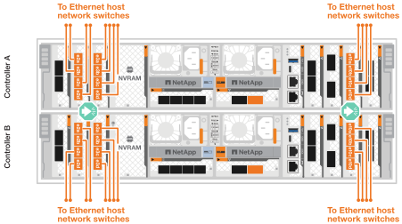

= ASA R2 스토리지 시스템용 하드웨어를 케이블로 연결합니다
:allow-uri-read: 
:icons: font
:imagesdir: ../media/

[role="lead"]
ASA R2 스토리지 시스템용 랙 하드웨어를 설치한 후 컨트롤러의 네트워크 케이블을 설치하고 컨트롤러와 스토리지 쉘프 간에 케이블을 연결합니다.

.시작하기 전에
스토리지 시스템을 네트워크 스위치에 연결하는 방법에 대한 자세한 내용은 네트워크 관리자에게 문의하십시오.

.이 작업에 대해
* 다음 절차는 일반적인 구성을 보여 줍니다. 특정 케이블 연결은 스토리지 시스템용으로 주문한 구성 요소에 따라 다릅니다. 포괄적인 구성 및 슬롯 우선 순위에 대한 자세한 내용은 을 link:https://hwu.netapp.com["NetApp Hardware Universe를 참조하십시오"^]참조하십시오.
* 클러스터/HA 및 호스트 네트워크 케이블 연결 절차는 일반적인 구성을 보여줍니다.
+
케이블링 절차에서 구성이 보이지 않으면 다음으로 이동하세요. link:https://hwu.netapp.com["NetApp Hardware Universe를 참조하십시오"^] 스토리지 시스템을 올바르게 케이블로 연결하기 위한 포괄적인 구성 및 슬롯 우선순위 정보를 확인하세요.

* ASA A1K, ASA A70 또는 ASA A90 스토리지 시스템이 있는 경우 I/O 슬롯은 1~11까지 번호가 매겨집니다.
+
image::../media/drw_a1K_back_slots_labeled_ieops-2162.svg[ASA A1K ASA A70 및 ASA A90 컨트롤러의 슬롯 번호 매기기]

* 케이블 연결 그래픽에는 포트에 커넥터를 삽입할 때 케이블 커넥터 당김 탭의 올바른 방향(위 또는 아래)을 나타내는 화살표 아이콘이 있습니다.
+
커넥터를 삽입할 때 딸깍 소리가 들려야 합니다. 딸깍 소리가 안 되면 커넥터를 제거하고 뒤집은 다음 다시 시도하십시오.

+
image:../media/drw_cable_pull_tab_direction_ieops-1699.svg["케이블 당김 탭 방향"]

* 광 스위치에 케이블로 연결하는 경우 광 트랜시버를 컨트롤러 포트에 삽입한 후 스위치 포트에 연결합니다.

== 1단계: 클러스터/HA 연결 케이블 연결

컨트롤러를 ONTAP 클러스터에 케이블로 연결합니다. 이 절차는 스토리지 시스템 모델 및 입출력 모듈 구성에 따라 다릅니다.

NOTE: 클러스터 인터커넥트 트래픽과 HA 트래픽은 동일한 물리적 포트를 공유합니다.

[role="tabbed-block"]
====
.A1K를 참조하십시오
--
ONTAP 클러스터 연결을 생성합니다. 스위치가 없는 클러스터의 경우 컨트롤러를 서로 연결합니다. 스위치 클러스터의 경우 컨트롤러를 클러스터 네트워크 스위치에 연결합니다.

.스위치가 없는 클러스터 케이블 연결
[%collapsible]
=====
클러스터/HA 인터커넥트 케이블을 사용하여 포트 E1A에 E1A를 연결하고 포트 e7a에 e7a를 연결합니다.

.단계
. 컨트롤러 A의 포트 E1A를 컨트롤러 B의 포트 E1A에 연결합니다
. 컨트롤러 A의 포트 e7a를 컨트롤러 B의 포트 E1A에 연결합니다
+
* 클러스터/HA 인터커넥트 케이블 *

+

+
image::../media/drw_a1k_tnsc_cluster_cabling_ieops-1648.svg[스위치가 없는 2노드 클러스터 케이블 연결 다이어그램]

=====
.스위치 클러스터 케이블링
[%collapsible]
=====
100 GbE 케이블을 사용하여 포트 E1A를 E1A에 연결하고 포트 e7a를 e7a에 연결합니다.

NOTE: 스위치 클러스터 구성은 9.16.1 이상에서 지원됩니다.

.단계
. 컨트롤러 A의 포트 E1A와 컨트롤러 B의 포트 E1A를 클러스터 네트워크 스위치 A에 연결합니다
. 컨트롤러 A의 포트 e7a와 컨트롤러 B의 포트 e7a를 클러스터 네트워크 스위치 B에 연결합니다
+
* 100 GbE 케이블 *

+
image::../media/oie_cable100_gbe_qsfp28.png[100Gb 케이블]

+
image::../media/drw_a1k_switched_cluster_cabling_ieops-1652.svg[클러스터 연결을 클러스터 네트워크에 케이블 연결합니다]

=====
--
.A70 및 A90
--
ONTAP 클러스터 연결을 생성합니다. 스위치가 없는 클러스터의 경우 컨트롤러를 서로 연결합니다. 스위치 클러스터의 경우 컨트롤러를 클러스터 네트워크 스위치에 연결합니다.

.스위치가 없는 클러스터 케이블 연결
[%collapsible]
=====
클러스터/HA 인터커넥트 케이블을 사용하여 포트 E1A에 E1A를 연결하고 포트 e7a에 e7a를 연결합니다.

.단계
. 컨트롤러 A의 포트 E1A를 컨트롤러 B의 포트 E1A에 연결합니다
. 컨트롤러 A의 포트 e7a를 컨트롤러 B의 포트 E1A에 연결합니다
+
* 클러스터/HA 인터커넥트 케이블 *

+

+
image::../media/drw_70-90_tnsc_cluster_cabling_ieops-1653.svg[스위치가 없는 2노드 클러스터 케이블 연결 다이어그램]

=====
.스위치 클러스터 케이블링
[%collapsible]
=====
100 GbE 케이블을 사용하여 포트 E1A를 E1A에 연결하고 포트 e7a를 e7a에 연결합니다.

NOTE: 스위치 클러스터 구성은 9.16.1 이상에서 지원됩니다.

.단계
. 컨트롤러 A의 포트 E1A와 컨트롤러 B의 포트 E1A를 클러스터 네트워크 스위치 A에 연결합니다
. 컨트롤러 A의 포트 e7a와 컨트롤러 B의 포트 e7a를 클러스터 네트워크 스위치 B에 연결합니다
+
* 100 GbE 케이블 *

+
image::../media/oie_cable100_gbe_qsfp28.png[100Gb 케이블]

+
image::../media/drw_70-90_switched_cluster_cabling_ieops-1657.svg[클러스터 연결을 클러스터 네트워크에 케이블 연결합니다]

=====
--
.A20, A30, A50을 지원합니다
--
ONTAP 클러스터 연결을 생성합니다. 스위치가 없는 클러스터의 경우 컨트롤러를 서로 연결합니다. 스위치 클러스터의 경우 컨트롤러를 클러스터 네트워크 스위치에 연결합니다.

*스위치 없는 클러스터 케이블 연결*

컨트롤러를 서로 연결하여 ONTAP 클러스터 연결을 생성합니다.

.2포트 40/100 GbE 입출력 모듈 2개가 장착된 ASA A30 및 ASA A50
[%collapsible]
=====
.단계
. 클러스터/HA 인터커넥트 연결:
+

NOTE: 클러스터 인터커넥트 트래픽과 HA 트래픽은 동일한 물리적 포트(슬롯 2와 4의 I/O 모듈)를 공유합니다. 포트는 40/100 GbE입니다.

+
.. 컨트롤러 A 포트 e2a를 컨트롤러 B 포트 e2a에 연결합니다.
.. 컨트롤러 A 포트 e4a를 컨트롤러 B 포트 e4a에 연결합니다.
+

NOTE: 입출력 모듈 포트 e2b 및 e4b는 사용되지 않으며 호스트 네트워크 연결에 사용할 수 있습니다.

+
* 100 GbE 클러스터/HA 인터커넥트 케이블 *

+
image::../media/oie_cable100_gbe_qsfp28.png[클러스터 HA 100GbE 케이블]

+
image::../media/drw_isi_a30-50_switchless_2p_100gbe_2card_cabling_ieops-2011.svg[2개의 100GbE IO 모듈을 사용하는 A30 및 A50 스위치가 없는 클러스터 케이블 연결 다이어그램]

=====
.ASA A30 및 ASA A50(2포트 40/100 GbE 입출력 모듈 1개 포함
[%collapsible]
=====
.단계
. 클러스터/HA 인터커넥트 연결:
+

NOTE: 클러스터 인터커넥트 트래픽과 HA 트래픽은 동일한 물리적 포트(슬롯 4의 I/O 모듈)를 공유합니다. 포트는 40/100 GbE입니다.

+
.. 컨트롤러 A 포트 e4a를 컨트롤러 B 포트 e4a에 연결합니다.
.. 컨트롤러 A 포트 e4b를 컨트롤러 B 포트 e4b에 연결합니다.
+
* 100 GbE 클러스터/HA 인터커넥트 케이블 *

+
image::../media/oie_cable100_gbe_qsfp28.png[클러스터 HA 100GbE 케이블]

+
image::../media/drw_isi_a30-50_switchless_2p_100gbe_1card_cabling_ieops-1925.svg[하나의 100GbE IO 모듈을 사용하는 A30 및 A50 스위치가 없는 클러스터 케이블 연결 다이어그램]

=====
.2포트 10/25 GbE 입출력 모듈 1개가 포함된 ASA A20
[%collapsible]
=====
.단계
. 클러스터/HA 인터커넥트 연결:
+

NOTE: 클러스터 인터커넥트 트래픽과 HA 트래픽은 동일한 물리적 포트(슬롯 4의 I/O 모듈)를 공유합니다. 포트는 10/25GbE입니다.

+
.. 컨트롤러 A 포트 e4a를 컨트롤러 B 포트 e4a에 연결합니다.
.. 컨트롤러 A 포트 e4b를 컨트롤러 B 포트 e4b에 연결합니다.
+
* 25GbE 클러스터/HA 인터커넥트 케이블 *

+
image:../media/oie_cable_sfp_gbe_copper.png["GbE SFP 구리 커넥터, 폭 = 100px"]

+
image::../media/drw_isi_a20_switchless_2p_25gbe_cabling_ieops-2018.svg[25GbE 입출력 모듈 1개를 사용한 A20 스위치 없는 클러스터 케이블 연결 다이어그램]

=====
* 스위치 클러스터 케이블 연결 *

컨트롤러를 클러스터 네트워크 스위치에 연결하여 ONTAP 클러스터 연결을 생성합니다.

.2포트 40/100 GbE 입출력 모듈 2개가 있는 ASA A30 또는 ASA A50
[%collapsible]
=====
.단계
. 클러스터/HA 인터커넥트 연결 케이블 연결:
+

NOTE: 클러스터 인터커넥트 트래픽과 HA 트래픽은 동일한 물리적 포트(슬롯 2와 4의 I/O 모듈)를 공유합니다. 포트는 40/100 GbE입니다.

+
.. 컨트롤러 A 포트 e4a를 클러스터 네트워크 스위치 A에 연결합니다.
.. 컨트롤러 A 포트 e2a를 클러스터 네트워크 스위치 B에 연결합니다.
.. 컨트롤러 B 포트 e4a를 클러스터 네트워크 스위치 A에 연결합니다.
.. 컨트롤러 B 포트 e2a를 클러스터 네트워크 스위치 B에 연결합니다.
+

NOTE: 입출력 모듈 포트 e2b 및 e4b는 사용되지 않으며 호스트 네트워크 연결에 사용할 수 있습니다.

+
* 40/100 GbE 클러스터/HA 인터커넥트 케이블 *

+
image::../media/oie_cable100_gbe_qsfp28.png[클러스터 HA 40/100 GbE 케이블]

+
image::../media/drw_isi_a30-50_switched_2p_100gbe_2card_cabling_ieops-2013.svg[2개의 100GbE IO 모듈을 사용하는 A30 및 A50 스위치 클러스터 케이블 다이어그램]

=====
.2포트 40/100 GbE 입출력 모듈 1개가 있는 ASA A30 또는 ASA A50
[%collapsible]
=====
.단계
. 컨트롤러를 클러스터 네트워크 스위치에 케이블 연결합니다.
+

NOTE: 클러스터 인터커넥트 트래픽과 HA 트래픽은 동일한 물리적 포트(슬롯 4의 I/O 모듈)를 공유합니다. 포트는 40/100 GbE입니다.

+
.. 컨트롤러 A 포트 e4a를 클러스터 네트워크 스위치 A에 연결합니다.
.. 컨트롤러 A 포트 e4b를 클러스터 네트워크 스위치 B에 연결합니다.
.. 컨트롤러 B 포트 e4a를 클러스터 네트워크 스위치 A에 연결합니다.
.. 컨트롤러 B 포트 e4b를 클러스터 네트워크 스위치 B에 연결합니다.
+
* 40/100 GbE 클러스터/HA 인터커넥트 케이블 *

+
image::../media/oie_cable100_gbe_qsfp28.png[클러스터 HA 40/100 GbE 케이블]

+
image::../media/drw_isi_a30-50_2p_100gbe_1card_switched_cabling_ieops-1926.svg[클러스터 연결을 클러스터 네트워크에 케이블 연결합니다]

=====
.2포트 10/25 GbE 입출력 모듈 1개가 포함된 ASA A20
[%collapsible]
=====
. 컨트롤러를 클러스터 네트워크 스위치에 케이블 연결합니다.
+

NOTE: 클러스터 인터커넥트 트래픽과 HA 트래픽은 동일한 물리적 포트(슬롯 4의 I/O 모듈)를 공유합니다. 포트는 10/25GbE입니다.

+
.. 컨트롤러 A 포트 e4a를 클러스터 네트워크 스위치 A에 연결합니다.
.. 컨트롤러 A 포트 e4b를 클러스터 네트워크 스위치 B에 연결합니다.
.. 컨트롤러 B 포트 e4a를 클러스터 네트워크 스위치 A에 연결합니다.
.. 컨트롤러 B 포트 e4b를 클러스터 네트워크 스위치 B에 연결합니다.
+
* 10/25GbE 클러스터/HA 인터커넥트 케이블 *

+
image::../media/oie_cable_sfp_gbe_copper.png[GbE SFP 구리 커넥터]

+
image::../media/drw_isi_a20_switched_2p_25gbe_cabling_ieops-2019.svg[25GbE 입출력 모듈 1개를 사용한 A20 스위치 클러스터 케이블 연결 다이어그램]

=====
--
.C30를 참조하십시오
--
ONTAP 클러스터 연결을 생성합니다. 스위치가 없는 클러스터의 경우 컨트롤러를 서로 연결합니다. 스위치 클러스터의 경우 컨트롤러를 클러스터 네트워크 스위치에 연결합니다.

*스위치 없는 클러스터 케이블 연결*

컨트롤러를 서로 연결하여 ONTAP 클러스터 연결을 생성합니다.

.2개의 2포트 40/100 GbE I/O 모듈이 있는 ASA C30
[%collapsible]
=====
.단계
. 클러스터/HA 인터커넥트 연결 케이블 연결:
+

NOTE: 클러스터 인터커넥트 트래픽과 HA 트래픽은 동일한 물리적 포트(슬롯 2와 4의 I/O 모듈)를 공유합니다. 포트는 40/100 GbE입니다.

+
.. 컨트롤러 A 포트 e2a를 컨트롤러 B 포트 e2a에 연결합니다.
.. 컨트롤러 A 포트 e4a를 컨트롤러 B 포트 e4a에 연결합니다.
+

NOTE: 입출력 모듈 포트 e2b 및 e4b는 사용되지 않으며 호스트 네트워크 연결에 사용할 수 있습니다.

+
* 100 GbE 클러스터/HA 인터커넥트 케이블 *

+
image::../media/oie_cable100_gbe_qsfp28.png[클러스터 HA 100GbE 케이블]

+
image::../media/drw_isi_a30-50_switchless_2p_100gbe_2card_cabling_ieops-2011.svg[2개의 100GbE IO 모듈을 사용하는 A30 및 A50 스위치가 없는 클러스터 케이블 연결 다이어그램]

=====
.2포트 40/100 GbE 입출력 모듈 1개가 포함된 ASA C30
[%collapsible]
=====
.단계
. 클러스터/HA 인터커넥트 연결 케이블 연결:
+

NOTE: 클러스터 인터커넥트 트래픽과 HA 트래픽은 동일한 물리적 포트(슬롯 4의 I/O 모듈)를 공유합니다. 포트는 40/100 GbE입니다.

+
.. 컨트롤러 A 포트 e4a를 컨트롤러 B 포트 e4a에 연결합니다.
.. 컨트롤러 A 포트 e4b를 컨트롤러 B 포트 e4b에 연결합니다.
+
* 100 GbE 클러스터/HA 인터커넥트 케이블 *

+
image::../media/oie_cable100_gbe_qsfp28.png[클러스터 HA 100GbE 케이블]

+
image::../media/drw_isi_a30-50_switchless_2p_100gbe_1card_cabling_ieops-1925.svg[하나의 100GbE IO 모듈을 사용하는 c30 스위치가 없는 클러스터 케이블 연결 다이어그램]

=====
* 스위치 클러스터 케이블 연결 *

컨트롤러를 클러스터 네트워크 스위치에 연결하여 ONTAP 클러스터 연결을 생성합니다.

.2개의 2포트 40/100 GbE I/O 모듈이 있는 ASA C30
[%collapsible]
=====
.단계
. 클러스터/HA 인터커넥트 연결 케이블 연결:
+

NOTE: 클러스터 인터커넥트 트래픽과 HA 트래픽은 동일한 물리적 포트(슬롯 2와 4의 I/O 모듈)를 공유합니다. 포트는 40/100 GbE입니다.

+
.. 컨트롤러 A 포트 e4a를 클러스터 네트워크 스위치 A에 연결합니다.
.. 컨트롤러 A 포트 e2a를 클러스터 네트워크 스위치 B에 연결합니다.
.. 컨트롤러 B 포트 e4a를 클러스터 네트워크 스위치 A에 연결합니다.
.. 컨트롤러 B 포트 e2a를 클러스터 네트워크 스위치 B에 연결합니다.
+

NOTE: 입출력 모듈 포트 e2b 및 e4b는 사용되지 않으며 호스트 네트워크 연결에 사용할 수 있습니다.

+
* 40/100 GbE 클러스터/HA 인터커넥트 케이블 *

+
image::../media/oie_cable100_gbe_qsfp28.png[클러스터 HA 40/100 GbE 케이블]

+
image::../media/drw_isi_a30-50_switched_2p_100gbe_2card_cabling_ieops-2013.svg[두 개의 100gbe io 모듈을 사용한 c30 스위치 클러스터 케이블링 다이어그램]

=====
.2포트 40/100 GbE 입출력 모듈 1개가 포함된 ASA C30
[%collapsible]
=====
.단계
. 컨트롤러를 클러스터 네트워크 스위치에 연결합니다.
+

NOTE: 클러스터 인터커넥트 트래픽과 HA 트래픽은 동일한 물리적 포트(슬롯 4의 I/O 모듈)를 공유합니다. 포트는 40/100 GbE입니다.

+
.. 컨트롤러 A 포트 e4a를 클러스터 네트워크 스위치 A에 연결합니다.
.. 컨트롤러 A 포트 e4b를 클러스터 네트워크 스위치 B에 연결합니다.
.. 컨트롤러 B 포트 e4a를 클러스터 네트워크 스위치 A에 연결합니다.
.. 컨트롤러 B 포트 e4b를 클러스터 네트워크 스위치 B에 연결합니다.
+
* 40/100 GbE 클러스터/HA 인터커넥트 케이블 *

+
image::../media/oie_cable100_gbe_qsfp28.png[클러스터 HA 40/100 GbE 케이블]

+
image::../media/drw_isi_a30-50_2p_100gbe_1card_switched_cabling_ieops-1926.svg[클러스터 연결을 클러스터 네트워크에 케이블 연결합니다]

=====
--
====

== 2단계: 호스트 네트워크 연결 케이블 연결

컨트롤러를 호스트 네트워크에 연결합니다.

이 절차는 스토리지 시스템 모델 및 입출력 모듈 구성에 따라 다릅니다.

[role="tabbed-block"]
====
.A1K를 참조하십시오
--
이더넷 모듈 포트를 호스트 네트워크에 연결합니다.

다음은 몇 가지 일반적인 호스트 네트워크 케이블 연결의 예입니다. 특정 시스템 구성은 를 link:https://hwu.netapp.com["NetApp Hardware Universe를 참조하십시오"^] 참조하십시오.

.단계
. 이더넷 데이터 네트워크 스위치에 e9a 및 e9b 포트를 연결합니다.
+

NOTE: 클러스터 및 HA 트래픽에 시스템 성능을 극대화하려면 호스트 네트워크 연결에 포트 e1b 및 e7b 포트를 사용하지 마십시오. 성능을 최대화하려면 별도의 호스트 카드를 사용하십시오.

+
* 100 GbE 케이블 *

+
image::../media/oie_cable_sfp_gbe_copper.svg[100Gb 이더넷 케이블]

+
image::../media/drw_a1k_network_cabling1_ieops-1649.svg[100Gb 이더넷 네트워크에 케이블 연결]

. 10/25 GbE 호스트 네트워크 스위치를 연결합니다.
+
* 10/25GbE 호스트 *

+
image::../media/oie_cable_sfp_gbe_copper.svg[10/25GB 이더넷 케이블]

+
image::../media/drw_a1k_network_cabling2_ieops-1650.svg[10/25GB 이더넷 네트워크에 케이블 연결]

--
.A70 및 A90
--
이더넷 모듈 포트를 호스트 네트워크에 연결합니다.

다음은 몇 가지 일반적인 호스트 네트워크 케이블 연결의 예입니다. 특정 시스템 구성은 를 link:https://hwu.netapp.com["NetApp Hardware Universe를 참조하십시오"^] 참조하십시오.

.단계
. 이더넷 데이터 네트워크 스위치에 e9a 및 e9b 포트를 연결합니다.
+

NOTE: 클러스터 및 HA 트래픽에 시스템 성능을 극대화하려면 호스트 네트워크 연결에 포트 e1b 및 e7b 포트를 사용하지 마십시오. 성능을 최대화하려면 별도의 호스트 카드를 사용하십시오.

+
* 100 GbE 케이블 *

+
image::../media/oie_cable_sfp_gbe_copper.svg[100Gb 이더넷 케이블]

+
image::../media/drw_70-90_network_cabling1_ieops-1654.svg[100Gb 이더넷 네트워크에 케이블 연결]

. 10/25 GbE 호스트 네트워크 스위치를 연결합니다.
+
* 4포트, 10/25 GbE 호스트 *

+
image::../media/oie_cable_sfp_gbe_copper.svg[10/25Gb 케이블]

+

--
.A20, A30, A50을 지원합니다
--
이더넷 모듈 포트 또는 FC(Fibre Channel) 모듈 포트를 호스트 네트워크에 연결합니다.

* 이더넷 호스트 케이블 연결 *

.2포트 40/100 GbE 입출력 모듈 2개가 장착된 ASA A30 및 ASA A50
[%collapsible]
=====
각 컨트롤러에서 포트 e2b 및 e4b를 이더넷 호스트 네트워크 스위치에 연결합니다.

NOTE: 슬롯 2 및 4의 입출력 모듈 포트는 40/100 GbE(호스트 접속은 40/100 GbE)입니다.

* 40/100 GbE 케이블 *

image::../media/oie_cable_sfp_gbe_copper.png[40/100 Gb 케이블]

image::../media/drw_isi_a30-50_host_2p_40-100gbe_2card_cabling_ieops-2014.svg[40/100GbE 이더넷 호스트 네트워크 스위치에 케이블 연결]

=====
.4포트 10/25 GbE I/O 모듈 1개가 포함된 ASA A20, A30 및 A50
[%collapsible]
=====
각 컨트롤러에서 포트 e2a, e2b, E2C 및 e2D를 이더넷 호스트 네트워크 스위치에 연결합니다.

* 10/25 GbE 케이블 *

image:../media/oie_cable_sfp_gbe_copper.png["GbE SFP 구리 커넥터, 폭 = 100px"]

image::../media/drw_isi_a30-50_host_2p_40-100gbe_1card_cabling_ieops-1923.svg[40/100GbE 이더넷 호스트 네트워크 스위치에 케이블 연결]

=====
* FC 호스트 케이블 연결 *

.4포트 64Gb/s FC I/O 모듈 1개가 포함된 ASA A20, A30 및 A50
[%collapsible]
=====
각 컨트롤러에서 포트 1a, 1b, 1c 및 1d 를 FC 호스트 네트워크 스위치에 연결합니다.

* 64 Gb/s FC 케이블 *

image:../media/oie_cable_sfp_gbe_copper.png["64Gb FC 케이블, 폭 = 100px"]

image::../media/drw_isi_a30-50_4p_64gb_fc_1card_cabling_ieops-1924.svg[64GB FC 호스트 네트워크 스위치에 대한 케이블 연결]

=====
--
.C30를 참조하십시오
--
이더넷 모듈 포트 또는 FC(Fibre Channel) 모듈 포트를 호스트 네트워크에 연결합니다.

* 이더넷 호스트 케이블 연결 *

.2개의 2포트 40/100 GbE I/O 모듈이 있는 ASA C30
[%collapsible]
=====
.단계
. 각 컨트롤러에서 이더넷 호스트 네트워크 스위치에 케이블 포트 e2b 및 e4b를 연결합니다.
+

NOTE: 슬롯 2 및 4의 입출력 모듈 포트는 40/100 GbE(호스트 접속은 40/100 GbE)입니다.

+
* 40/100 GbE 케이블 *

+
image::../media/oie_cable_sfp_gbe_copper.png[40/100 Gb 케이블]

+
image::../media/drw_isi_a30-50_host_2p_40-100gbe_2card_cabling_ieops-2014.svg[40/100GbE 이더넷 호스트 네트워크 스위치에 케이블 연결]

=====
.4포트 10/25 GbE 입출력 모듈 1개가 포함된 ASA C30
[%collapsible]
=====
.단계
. 각 컨트롤러에서 이더넷 호스트 네트워크 스위치에 케이블 포트 e2a, e2b, E2C 및 e2D를 연결합니다.
+
* 10/25 GbE 케이블 *

+
image:../media/oie_cable_sfp_gbe_copper.png["GbE SFP 구리 커넥터, 폭 = 100px"]

+
image::../media/drw_isi_a30-50_host_2p_40-100gbe_1card_cabling_ieops-1923.svg[40/100GbE 이더넷 호스트 네트워크 스위치에 케이블 연결]

=====
.4포트 64Gb/s FC I/O 모듈 1개가 포함된 ASA C30
[%collapsible]
=====
.단계
. 각 컨트롤러에서 포트 1a, 1b, 1c 및 1d를 FC 호스트 네트워크 스위치에 연결합니다.
+
* 64 Gb/s FC 케이블 *

+
image:../media/oie_cable_sfp_gbe_copper.png["64Gb FC 케이블, 폭 = 100px"]

+
image::../media/drw_isi_a30-50_4p_64gb_fc_1card_cabling_ieops-1924.svg[64GB FC 호스트 네트워크 스위치에 대한 케이블 연결]

=====
--
====

== 3단계: 관리 네트워크 연결 케이블 연결

컨트롤러를 관리 네트워크에 연결합니다.

스토리지 시스템을 관리 네트워크 스위치에 연결하는 방법에 대한 자세한 내용은 네트워크 관리자에게 문의하십시오.

[role="tabbed-block"]
====
.A1K를 참조하십시오
--
1000BASE-T RJ-45 케이블을 사용하여 각 컨트롤러의 관리(렌치) 포트를 관리 네트워크 스위치에 연결합니다.

image::../media/oie_cable_rj45.svg[RJ-45 케이블]

* 1000BASE-T RJ-45 케이블 *

image::../media/drw_a1k_management_connection_ieops-1651.svg[관리 네트워크에 연결합니다]

IMPORTANT: 아직 전원 코드를 연결하지 마십시오.

--
.A70 및 A90
--
1000BASE-T RJ-45 케이블을 사용하여 각 컨트롤러의 관리(렌치) 포트를 관리 네트워크 스위치에 연결합니다.

image::../media/oie_cable_rj45.svg[RJ45 케이블]

* 1000BASE-T RJ-45 케이블 *

image::../media/drw_70-90_management_connection_ieops-1656.svg[관리 네트워크에 연결합니다]

IMPORTANT: 아직 전원 코드를 연결하지 마십시오.

--
.A20, A30, A50을 지원합니다
--
각 컨트롤러의 관리(렌치) 포트를 관리 네트워크 스위치에 연결합니다.

* 1000BASE-T RJ-45 케이블 *

image::../media/oie_cable_rj45.png[RJ-45 케이블]

image::../media/drw_isi_g_wrench_cabling_ieops-1928.svg[관리 네트워크에 연결합니다]

IMPORTANT: 아직 전원 코드를 연결하지 마십시오.

--
.C30를 참조하십시오
--
각 컨트롤러의 관리(렌치) 포트를 관리 네트워크 스위치에 연결합니다.

* 1000BASE-T RJ-45 케이블 *

image::../media/oie_cable_rj45.png[RJ-45 케이블]

image::../media/drw_isi_g_wrench_cabling_ieops-1928.svg[관리 네트워크에 연결합니다]

IMPORTANT: 아직 전원 코드를 연결하지 마십시오.

--
====

== 4단계: 선반 연결 케이블 연결

다음 케이블 연결 절차는 컨트롤러를 스토리지 쉘프에 연결하는 방법을 보여줍니다.

스토리지 시스템에서 지원되는 최대 쉘프 수와 광 및 스위치 연결과 같은 모든 케이블 옵션은 을 참조하십시오.link:https://hwu.netapp.com["NetApp Hardware Universe를 참조하십시오"^]

[role="tabbed-block"]
====
.A1K를 참조하십시오
--
AFF A1K 스토리지 시스템은 NSM100 또는 NSM100B 모듈을 사용하여 NS224 선반을 지원합니다. 두 모듈의 주요 차이점은 다음과 같습니다.

* NSM100 쉘프 모듈은 내장 포트 e0a 및 e0b를 사용합니다.
* NSM100B 쉘프 모듈은 슬롯 1의 포트 e1a와 e1b를 사용합니다.

다음 케이블링 예는 쉘프 모듈 포트를 참조할 때 NS224 쉘프에 있는 NSM100 모듈을 보여줍니다.

설정에 맞는 다음 케이블 연결 옵션 중 하나를 선택합니다.

.옵션 1: NS224 스토리지 쉘프 1개
[%collapsible]
=====
각 컨트롤러를 NS224 쉘프의 NSM 모듈에 연결합니다. 그래픽은 각 컨트롤러의 케이블 연결을 보여줍니다. 컨트롤러 A 케이블은 파란색으로 표시되고 컨트롤러 B 케이블은 노란색으로 표시됩니다.

.단계
. 컨트롤러 A에서 다음 포트를 연결합니다.
+
.. 포트 e11a를 NSM A 포트 e0a에 연결합니다.
.. 포트 e11b를 포트 NSM B 포트 e0b에 연결합니다.
+
image:../media/drw_a1k_1shelf_cabling_a_ieops-1703.svg["컨트롤러 A e11a 및 e11b - 단일 NS224 쉘프"]

. 컨트롤러 B에서 다음 포트를 연결합니다.
+
.. 포트 e11a를 NSM B 포트 e0a에 연결합니다.
.. 포트 e11b를 NSM A 포트 e0b에 연결합니다.
+
image:../media/drw_a1k_1shelf_cabling_b_ieops-1704.svg["컨트롤러 B 포트 e11a 및 e11b를 단일 NS224 선반에 연결합니다."]

=====
.옵션 2: NS224 스토리지 쉘프 2개
[%collapsible]
=====
각 컨트롤러를 두 NS224 쉘프의 NSM 모듈에 연결합니다. 그래픽은 각 컨트롤러의 케이블 연결을 보여줍니다. 컨트롤러 A 케이블은 파란색으로 표시되고 컨트롤러 B 케이블은 노란색으로 표시됩니다.

.단계
. 컨트롤러 A에서 다음 포트를 연결합니다.
+
.. 포트 e11a를 쉘프 1 NSM A 포트 e0a에 연결합니다.
.. 포트 e11b를 쉘프 2 NSM B 포트 e0b에 연결합니다.
.. 포트 e10a를 쉘프 2 NSM A 포트 e0a에 연결합니다.
.. 포트 e10b를 쉘프 1 NSM A 포트 e0b에 연결합니다.
+
image:../media/drw_a1k_2shelf_cabling_a_ieops-1705.svg["컨트롤러 A의 컨트롤러-쉘프 연결"]

. 컨트롤러 B에서 다음 포트를 연결합니다.
+
.. 포트 e11a를 쉘프 1 NSM B 포트 e0a에 연결합니다.
.. 포트 e11b를 쉘프 2 NSM A 포트 e0b에 연결합니다.
.. 포트 e10a를 쉘프 2 NSM B 포트 e0a에 연결합니다.
.. 포트 e10b를 쉘프 1 NSM A 포트 e0b에 연결합니다.
+
image:../media/drw_a1k_2shelf_cabling_b_ieops-1706.svg["컨트롤러 B의 컨트롤러-쉘프 연결"]

=====
--
.A70 및 A90
--
AFF A70 및 90 스토리지 시스템은 NSM100 또는 NSM100B 모듈을 사용하여 NS224 선반을 지원합니다. 두 모듈의 주요 차이점은 다음과 같습니다.

* NSM100 선반 모듈은 내장 포트 e0a 및 e0b를 사용합니다.
* NSM100B 쉘프 모듈은 슬롯 1의 포트 e1a와 e1b를 사용합니다.

다음 케이블링 예는 쉘프 모듈 포트를 참조할 때 NS224 쉘프에 있는 NSM100 모듈을 보여줍니다.

설정에 맞는 다음 케이블 연결 옵션 중 하나를 선택합니다.

.옵션 1: NS224 스토리지 쉘프 1개
[%collapsible]
=====
각 컨트롤러를 NS224 쉘프의 NSM 모듈에 연결합니다. 그래픽은 각 컨트롤러의 케이블 연결을 보여줍니다. 컨트롤러 A 케이블은 파란색으로 표시되고 컨트롤러 B 케이블은 노란색으로 표시됩니다.

* 100 GbE QSFP28 구리 케이블 *

image::../media/oie_cable100_gbe_qsfp28.svg[100 GbE QSFP28 구리 케이블]

.단계
. 컨트롤러 A 포트 e11a를 NSM A 포트 e0a에 연결합니다.
. 컨트롤러 A 포트 e11b를 포트 NSM B 포트 e0b에 연결합니다.
+
image:../media/drw_a70-90_1shelf_cabling_a_ieops-1731.svg["컨트롤러 A e11a 및 e11b - 단일 NS224 쉘프"]

. 컨트롤러 B 포트 e11a를 NSM B 포트 e0a에 연결합니다.
. 컨트롤러 B 포트 e11b를 NSM A 포트 e0b에 연결합니다.
+
image:../media/drw_a70-90_1shelf_cabling_b_ieops-1732.svg["컨트롤러 B e11a 및 e11b - 단일 NS224 쉘프"]

=====
.옵션 2: NS224 스토리지 쉘프 2개
[%collapsible]
=====
각 컨트롤러를 두 NS224 쉘프의 NSM 모듈에 연결합니다. 그래픽은 각 컨트롤러의 케이블 연결을 보여줍니다. 컨트롤러 A 케이블은 파란색으로 표시되고 컨트롤러 B 케이블은 노란색으로 표시됩니다.

* 100 GbE QSFP28 구리 케이블 *

image::../media/oie_cable100_gbe_qsfp28.svg[100 GbE QSFP28 구리 케이블]

.단계
. 컨트롤러 A에서 다음 포트를 연결합니다.
+
.. 포트 e11a를 쉘프 1, NSM A 포트 e0a에 연결합니다.
.. 포트 e11b를 쉘프 2,NSM B 포트 e0b에 연결합니다.
.. 포트 e8a를 쉘프 2, NSM A 포트 e0a에 연결합니다.
.. 포트 e8b를 쉘프 1,NSM B 포트 e0b에 연결합니다.
+
image:../media/drw_a70-90_2shelf_cabling_a_ieops-1733.svg["컨트롤러 A의 컨트롤러-쉘프 연결"]

. 컨트롤러 B에서 다음 포트를 연결합니다.
+
.. 포트 e11a를 쉘프 1, NSM B 포트 e0a에 연결합니다.
.. 포트 e11b를 쉘프 2,NSM A 포트 e0b에 연결합니다.
.. 포트 e8a를 쉘프 2, NSM B 포트 e0a에 연결합니다.
.. 포트 e8b를 쉘프 1,NSM A 포트 e0b에 연결합니다.
+
image:../media/drw_a70-90_2shelf_cabling_b_ieops-1734.svg["컨트롤러 B의 컨트롤러-쉘프 연결"]

=====
--
.A20, A30, A50을 지원합니다
--
NS224 쉘프 케이블 연결 절차는 NSM100 모듈 대신 NSM100B 모듈을 사용합니다. 케이블 연결은 사용된 NSM 모듈의 종류와 관계없이 동일하며, 포트 이름만 다릅니다.

* NSM100B 모듈은 슬롯 1의 I/O 모듈에서 포트 e1a 및 e1b를 사용합니다.
* NSM100 모듈은 내장(온보드) 포트 e0a 및 e0b를 사용합니다.

스토리지 시스템과 함께 제공된 스토리지 케이블을 사용하여 NS224 선반의 각 NSM 모듈에 각 컨트롤러를 케이블로 연결합니다. 스토리지 케이블의 케이블 유형은 다음과 같습니다.

* 100 GbE QSFP28 구리 케이블 *

image::../media/oie_cable100_gbe_qsfp28.png[100 GbE QSFP28 구리 케이블]

그래픽은 컨트롤러 A 케이블을 파란색으로, 컨트롤러 B 케이블은 노란색으로 표시합니다.

.단계
. 컨트롤러 A를 쉘프에 연결:
+
.. 컨트롤러 A 포트 e3a를 NSM A 포트 e1a에 연결합니다.
.. 컨트롤러 A 포트 e3b를 NSM B 포트 e1b에 연결합니다.
+
image:../media/drw_isi_g_1_ns224_controller_a_cabling_ieops-1945.svg["하나의 NS224 쉘프에 컨트롤러 A 포트 e3a 및 e3b 케이블 연결"]

. 컨트롤러 B를 쉘프에 연결:
+
.. 컨트롤러 B 포트 e3a를 NSM B 포트 e1a에 연결합니다.
.. 컨트롤러 B 포트 e3b를 NSM A 포트 e1b에 연결합니다.
+
image:../media/drw_isi_g_1_ns224_controller_b_cabling_ieops-1946.svg["하나의 NS224 쉘프에 컨트롤러 B 포트 e3a 및 e3b 케이블 연결"]

--
.C30를 참조하십시오
--
NS224 쉘프 케이블 연결 절차는 NSM100 모듈 대신 NSM100B 모듈을 사용합니다. 케이블 연결은 사용된 NSM 모듈의 종류와 관계없이 동일하며, 포트 이름만 다릅니다.

* NSM100B 모듈은 슬롯 1의 I/O 모듈에서 포트 e1a 및 e1b를 사용합니다.
* NSM100 모듈은 내장(온보드) 포트 e0a 및 e0b를 사용합니다.

스토리지 시스템과 함께 제공된 스토리지 케이블을 사용하여 NS224 선반의 각 NSM 모듈에 각 컨트롤러를 케이블로 연결합니다. 스토리지 케이블의 케이블 유형은 다음과 같습니다.

* 100 GbE QSFP28 구리 케이블 *

image::../media/oie_cable100_gbe_qsfp28.png[100 GbE QSFP28 구리 케이블]

그래픽은 컨트롤러 A 케이블을 파란색으로, 컨트롤러 B 케이블은 노란색으로 표시합니다.

.단계
. 컨트롤러 A를 쉘프에 연결:
+
.. 컨트롤러 A 포트 e3a를 NSM A 포트 e1a에 연결합니다.
.. 컨트롤러 A 포트 e3b를 NSM B 포트 e1b에 연결합니다.
+
image:../media/drw_isi_g_1_ns224_controller_a_cabling_ieops-1945.svg["하나의 NS224 쉘프에 컨트롤러 A 포트 e3a 및 e3b 케이블 연결"]

. 컨트롤러 B를 쉘프에 연결:
+
.. 컨트롤러 B 포트 e3a를 NSM B 포트 e1a에 연결합니다.
.. 컨트롤러 B 포트 e3b를 NSM A 포트 e1b에 연결합니다.
+
image:../media/drw_isi_g_1_ns224_controller_b_cabling_ieops-1946.svg["하나의 NS224 쉘프에 컨트롤러 B 포트 e3a 및 e3b 케이블 연결"]

--
====
.다음 단계
스토리지 컨트롤러를 네트워크에 연결한 다음, 컨트롤러를 스토리지 쉘프에 연결한 후에link:power-on-hardware.html["ASA R2 스토리지 시스템의 전원을 켭니다"]
