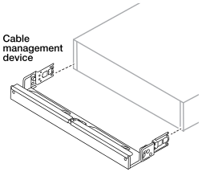

= ASA R2 스토리지 시스템을 설치합니다
:allow-uri-read: 
:icons: font
:imagesdir: ../media/

[role="lead"]
ASA R2 스토리지 시스템을 설치할 준비가 되면 시스템용 하드웨어를 설치합니다. 먼저 레일 키트를 설치합니다. 그런 다음 스토리지 시스템을 캐비닛이나 통신 랙에 설치하고 고정합니다.

.시작하기 전에
* 지침이 레일 키트와 함께 포장되어 있는지 확인하십시오.
* 보관 시스템 및 보관 선반의 무게와 관련된 안전 문제에 유의하십시오.
* 스토리지 시스템을 통과하는 공기 흐름은 베젤 또는 엔드 캡이 설치된 전면에서 유입되고 포트가 있는 후면에서 배출됩니다.

.단계
. 키트와 함께 제공되는 지침에 따라 필요에 따라 스토리지 시스템 및 스토리지 셸프용 레일 키트를 설치합니다.
. 스토리지 시스템을 캐비닛 또는 통신 랙에 설치하고 고정합니다.
+
.. 기억 장치 시스템을 캐비닛 또는 통신 랙의 중간에 있는 레일에 놓은 다음, 하단에서 기억 장치 시스템을 지지하고 제자리에 밀어 넣습니다.
.. 캐비닛이나 통신 랙의 가이드 핀이 스토리지 시스템 가이드 슬롯에 안전하게 들어맞는지 확인하세요.
.. 함께 제공된 장착 나사를 사용하여 저장 장치 시스템을 캐비닛이나 텔코 랙에 고정합니다.

. 베젤을 스토리지 시스템의 전면에 장착합니다.
. ASA R2 시스템에 케이블 관리 장치가 함께 제공된 경우 스토리지 시스템 뒷면에 연결합니다.
+

. 스토리지 쉘프를 설치하고 고정하십시오.
+
.. 보관 선반의 후면을 레일에 놓은 다음 하단에서 선반을 지지하고 캐비닛이나 텔코 랙에 밀어 넣습니다.
+
여러 스토리지 쉘프를 설치하는 경우 첫 번째 스토리지 쉘프를 컨트롤러 바로 위에 배치하십시오. 두 번째 스토리지 쉘프를 컨트롤러 바로 아래에 배치합니다. 추가 스토리지 셸프에 대해 이 패턴을 반복합니다.

.. 함께 제공된 장착 나사를 사용하여 저장 장치 쉘프를 캐비닛이나 텔코 랙에 고정합니다.

.다음 단계
ASA R2 시스템용 하드웨어를 설치한 후에는link:cable-hardware.html["ASA R2 시스템의 컨트롤러와 스토리지 쉘프를 케이블로 연결합니다"]
