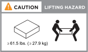

= ASA R2 스토리지 시스템의 설치 요구 사항
:allow-uri-read: 
:icons: font
:imagesdir: ../media/

[role="lead"]
ASA R2 스토리지 시스템 및 스토리지 셸프에 필요한 장비 및 인양 주의 사항을 검토합니다.

== 설치에 필요한 장비

ASA R2 스토리지 시스템을 설치하려면 다음과 같은 장비와 툴이 필요합니다.

* 웹 브라우저에 액세스하여 스토리지 시스템을 구성합니다
* 정전기 방전(ESD) 스트랩
* 플래시
* USB/직렬 연결이 있는 랩톱 또는 콘솔
* 보관 선반 ID 설정을 위한 종이 클립 또는 끝이 뾰족한 볼펜
* Phillips #2 드라이버

== 인양 주의 사항

ASA R2 스토리지 시스템과 스토리지 쉘프는 무겁습니다. 이러한 품목을 들어 올리거나 이동할 때는 주의를 기울이십시오.

=== 스토리지 시스템 중량

ASA R2 스토리지 시스템을 이동하거나 들어올릴 때 필요한 예방 조치를 취하십시오.

[role="tabbed-block"]
====
.A1K를 참조하십시오
--
ASA A1K 저장 장치 시스템의 무게는 최대 28.5kg(62.83파운드)입니다. 보관 시스템을 인양하려면 두 사람 또는 유압 리프트를 사용합니다.

image::../media/drw_a1k_weight_caution_ieops-1698.svg[ASA A1K 인양 주의 아이콘]

--
.A70 및 A90
--
ASA A70 또는 ASA A90 저장 장치 시스템의 무게는 최대 68.8kg(151.68파운드)입니다. 보관 시스템을 인양하려면 네 명 또는 유압 리프트를 사용합니다.

image::../media/drw_a70-90_weight_icon_ieops-1730.svg[ASA A90 를 참조하십시오]

--
.A20, A30, A50을 지원합니다
--
ASA A20, ASA A30 또는 ASA A50 저장 장치 시스템의 무게는 최대 27.9kg(61.5lbs)입니다. 보관 시스템을 인양하려면 두 사람 또는 유압 리프트를 사용합니다.

--
====

=== 보관 선반 중량

선반을 옮기거나 들어올릴 때 필요한 예방 조치를 취하십시오.

[role="tabbed-block"]
====
.NS224 쉘프
--
NS224 선반의 무게는 최대 30.29kg(66.78lbs)입니다. 선반을 인양하려면 두 사람이 함께 작업하거나 유압식 리프트를 사용하십시오. 선반 무게의 균형을 맞추기 위해 모든 구성 요소를 선반(전면 및 후면 모두)에 보관하십시오.

image::../media/drw_ns224_lifting_weight_ieops-1716.svg[NS224 NSM100 인양 주의]

--
.NSM100B 모듈 포함 NS224 쉘프
--
NSM100B 모듈이 포함된 NS224 선반의 무게는 최대 25.8kg(56.8파운드)입니다. 선반을 인양하려면 두 사람이 함께 작업하거나 유압식 리프트를 사용하십시오. 선반 무게의 균형을 맞추기 위해 모든 구성 요소를 선반(전면 및 후면 모두)에 보관하십시오.

image::../media/drw_ns224_nsm100b_lifting_weight_ieops-1832.svg[NS224(NSM100b 인양 주의 포함]

--
====
.관련 정보
* https://library.netapp.com/ecm/ecm_download_file/ECMP12475945["안전 정보 및 규정 고지"^]

.다음 단계
하드웨어 요구 사항을 검토한 후link:prepare-hardware.html["ASA R2 스토리지 시스템 설치를 준비합니다"]
